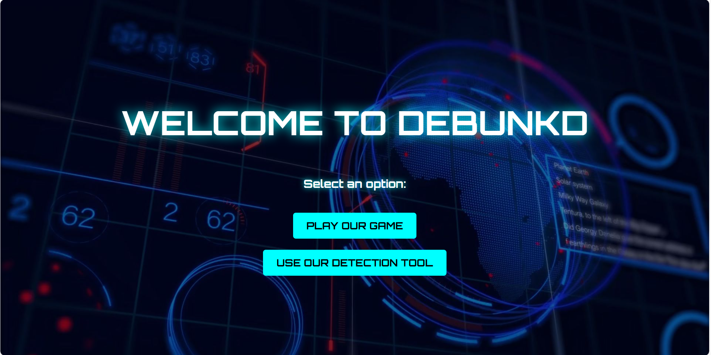

# **Debunkd**  
### **Real or Fake? Test Your Skills & AI-Powered Verification**  
<p align="left">

</p>

---

## 🚀 **Demo**  
Check out a quick demo of our prototype:  
[[Watch the Demo](https://www.youtube.com/watch?v=Q8HLCUGpSJg)]

---

## **🔹 Key Features**  

### **1. Text Extraction from Images (OCR)**  
- **Debunkd** utilizes **Optical Character Recognition (OCR)** powered by **Tesseract** to extract text from uploaded images.  
- This allows even visual content to be analyzed for **potential misinformation**.

### **2. Fact-Checking with RAG Model**  
- The extracted text is processed by a **Retrieval-Augmented Generation (RAG) model**.  
- The model **converts the text into embeddings** and performs a **similarity search** using a **vector database (ChromaDB)** to cross-reference facts.  

### **3. Real-World Fact-Checking (Google Fact Check API)**  
- Debunkd integrates with **Google’s Fact Check Tools API** to fetch real-world fact-checking data.  
- This ensures the results remain **accurate and up-to-date**.

### **4. AI-Powered Response Generation**  
- The **ChatGroq LLM** generates **human-like responses**, explaining the validity of claims and providing **additional context**.  
- Users can interact with the **AI-powered chatbot** for further verification.

---

## **🎮 Game Mode: Real or Fake?**  
- Users are shown an image and must decide if it’s **real or fake**.  
- A **score tracker** records user performance.  
- **High scores** are stored and displayed for **competitive play**.  

---

## **🖼️ AI-Powered Image Verification**  
Users can verify an image in two ways:  
1. **Upload an image** (or select a sample) – The system performs **LLM-based analysis** & **OCR (Tesseract)** to assess authenticity.  
2. **Chatbot for deeper insights** – Users can chat with an **AI assistant** to get explanations and verify claims.  

---

## **💬 Chatbot with Context Memory (Powered by ChatGroq LLM)**  
- The chatbot **remembers previous messages**, making conversations **cohesive and intelligent**.  
- Users can **ask follow-up questions** and receive context-aware responses.  

#### **Example Conversation:**  
💬 **User:** *"Joe Biden is dead."*  
🤖 **System:** *"No, Joe Biden is alive. Here are some reliable sources: …"*  
💬 **User:** *"Then how old is he?"*  
🤖 **System:** *"Joe Biden is 81 years old."* (instead of generating a generic response)  

---

## **🛠️ Tech Stack**  

| Component         | Technology Used                     |
|------------------|-----------------------------------|
| **Frontend**     | HTML, CSS, JavaScript             |
| **Backend**      | Python (Flask, Langchain)        |
| **AI & Image Processing** | ChatGroq (LLM), Langchain, Tesseract OCR |
| **Database**     | Supabase (stores real/fake image data), ChromaDB (Vector Database), Google Fact Checker API |
| **Deployment**   | Render (backend), Vercel (frontend) |

---

## **📌 Installation & Setup**  

### **1️⃣ Clone the repository**  
```sh
git clone https://github.com/tiffmun/debunkd.git
cd debunkd
